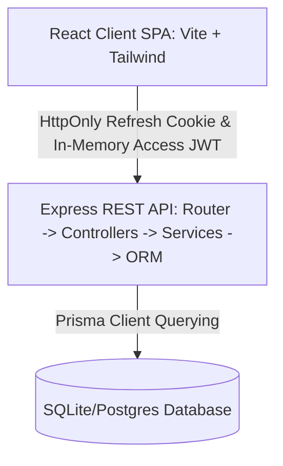
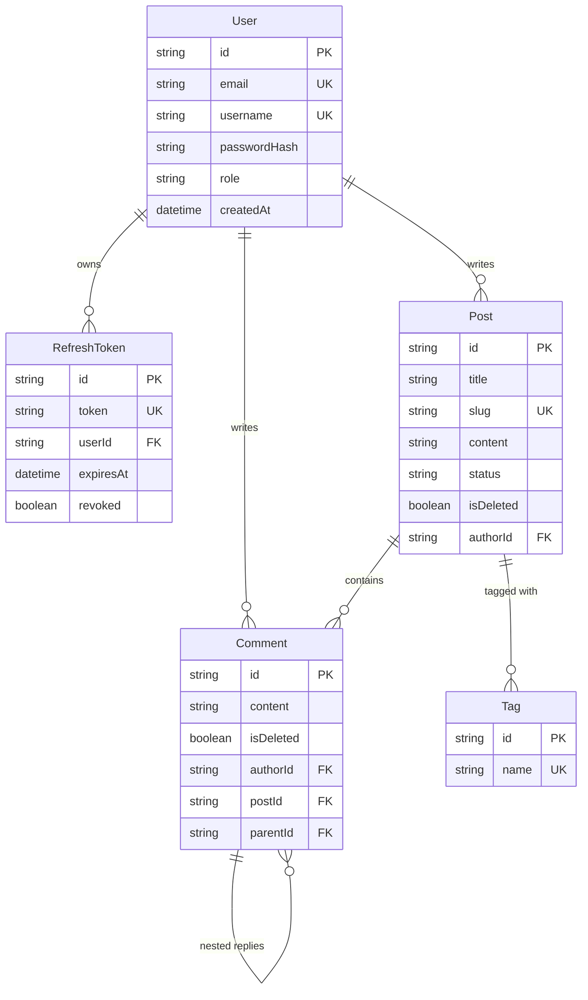

# ByteStream Secure Blogging Platform

A secure, scalable, and production-ready full-stack blogging platform built with **Node.js (Express) + TypeScript + Prisma ORM** on the backend and **React (Vite) + TypeScript + Tailwind CSS** on the frontend.

---

## 🏗️ Architecture & Component Flow

The platform utilizes a modern layered monorepo architecture. 



1. **Client (React SPA)**: Stored access tokens in-memory to prevent XSS storage theft, utilizing a silent background fetch interceptor to exchange the HttpOnly refresh token cookie on expiration.
2. **Server (Express.js)**: Implemented request tracing (x-request-id), structured logging (Winston), input validation (Zod), rate-limiting, and central error routing.
3. **Database (Prisma ORM)**: Type-safe queries, critical indexes (on slugs, creators, and comment nodes), and soft-delete behaviors.

---

## 🔐 Security Configuration

| Security Vector | Implementation Detail | Justification |
| :--- | :--- | :--- |
| **Password Hashing** | Bcrypt (12 cost factor) | Deliberate cryptographic cost overhead to resist high-speed GPU offline cracking. |
| **Access Token** | JWT (short-lived, 15m) | Kept in-memory by the React client. Prevents access via malicious XSS scripts. |
| **Refresh Token** | Random Bytes (long-lived, 7d) | Stored in `httpOnly`, `Secure`, `SameSite=Strict` cookie. Protected from JS document extraction. |
| **Token Rotation** | Automatic Rotation | Reusing an old refresh token instantly revokes all active sessions for that user (Breach Detection). |
| **Rate Limiting** | 20 requests per 15 minutes | selectively applied to `/auth/register` and `/auth/login` to thwart dictionary/brute-force attacks. |
| **XSS Defense** | DOMPurify + marked | Content is stored as raw Markdown and sanitized client-side before render to eliminate HTML script execution. |
| **CSRF Defense** | Strict SameSite Cookie | Setting `SameSite=Strict` limits cookie attachments to top-level cross-site GET requests, blocking CSRF. |

---

## 📂 Database Entity Relationship



---

## ⚡ Quick Start

### Prerequisites
* Node.js (v18+)
* npm (v9+)

### Installation & Database Sync
1. Clone the project and install all dependencies:
   ```bash
   npm run install:all
   ```
2. Setup the local SQLite database and push the Prisma schema:
   ```bash
   npx prisma db push --schema=backend/prisma/schema.prisma
   ```
3. Pre-populate the database tables with tags, users, posts, and recursive comment threads:
   ```bash
   npm run db:seed --prefix backend
   ```

### Running the Application
Run both servers concurrently:
```bash
npm run dev
```
* **Frontend Client**: [http://localhost:5173](http://localhost:5173)
* **Backend Server**: [http://localhost:3001](http://localhost:3001)
* **API Documentation**: OpenAPI spec file resides in [openapi.json](./backend/src/utils/openapi.json)

---

## 🧪 Testing

Run backend integration suites (supertest + jest):
```bash
npm run test:backend
```
The integration tests cover:
* Authentication flows & duplicate checks.
* Token Rotation logic and compromise detection.
* Post CRUD permissions (Guest vs. Author vs. Admin).
* Threaded comment reply stiches and soft-deletes.

---

## 👥 Seeding Accounts (For Reviewers)

| Role | Username | Email | Password |
| :--- | :--- | :--- | :--- |
| **Admin** | `admin` | `admin@blog.com` | `Password123!` |
| **Author** | `author1` | `author1@blog.com` | `Password123!` |
| **Reader** | `reader1` | `reader1@blog.com` | `Password123!` |

---

## 🌐 Deployment Instructions

### 1. Database & Backend Deployment (Render)
We have included a `render.yaml` blueprint to orchestrate a PostgreSQL database and the Node.js Express backend with a single click.

1. **Configure Prisma for Production**:
   * Open `backend/prisma/schema.prisma`.
   * Modify the `datasource db` block to use PostgreSQL:
     ```prisma
     datasource db {
       provider = "postgresql"
       url      = env("DATABASE_URL")
     }
     ```
2. **Deploy to Render**:
   * Push your codebase to a private/public GitHub repository.
   * Log into your **Render Dashboard** and select **New** -> **Blueprint**.
   * Connect your GitHub repository. Render will automatically parse the `render.yaml` file, spin up a secure PostgreSQL instance, bind the database connection string to your backend web service, and run the start script.
   * Once your backend finishes deploying, note the generated Render service URL (e.g., `https://blog-platform-backend.onrender.com`).

---

### 2. Frontend Deployment (Vercel)
Vercel is optimal for hosting the React client SPA.

1. Log into your **Vercel Dashboard** and click **Add New** -> **Project**.
2. Import your GitHub repository.
3. In the project configuration:
   * **Root Directory**: Select `frontend` (crucial for monorepos).
   * **Environment Variables**: Add a new key:
     * Key: `VITE_API_URL`
     * Value: `https://your-render-backend-url.onrender.com/api/v1` (replace with your actual Render URL).
4. Click **Deploy**. Vercel will auto-compile Vite assets and launch the client.
5. Copy your deployed Vercel URL and update the `FRONTEND_URL` environment variable on your Render backend dashboard to enable secure CORS requests.

---

## 🚀 Future Roadmap (v2 Suggestions)
1. **Search Integration**: Incorporate Meilisearch or Elasticsearch to support post content indexing.
2. **AWS S3 Storage**: Replace string cover URLs with an upload field using pre-signed AWS S3 post requests.
3. **Redis Caching**: Cache public post summaries and tags lists to increase request performance under high-concurrency loads.
4. **WebSocket Notifications**: Push real-time comment reply alerts to authors using Socket.io.
